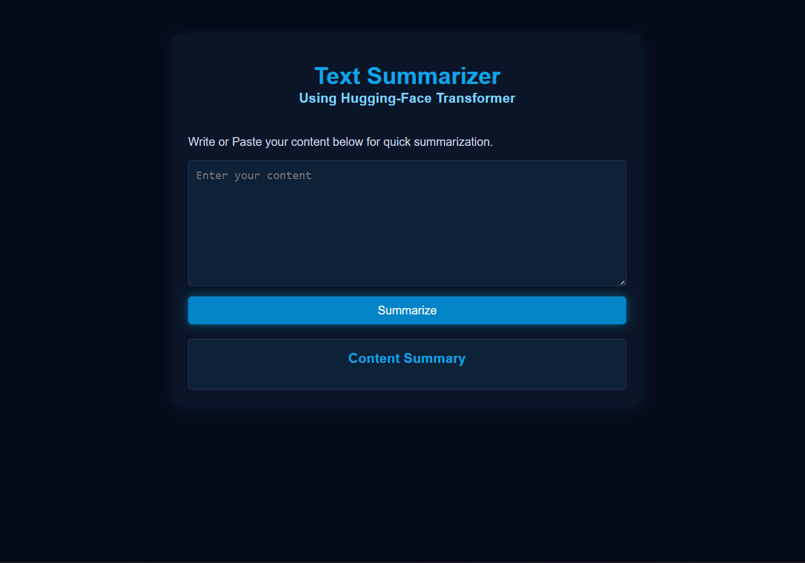
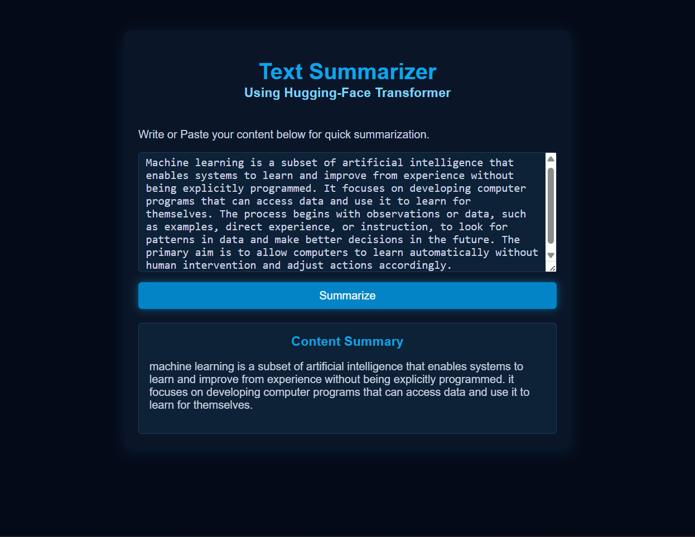

# 📝 Text Summarization using Fine-Tuned T5

### 👨‍💻 Developed by Jainish

This project is an end-to-end **abstractive text summarization system** built using a fine-tuned **T5 (Text-to-Text Transfer Transformer)** model from Hugging Face. It generates concise and meaningful summaries from long textual inputs while preserving the overall context.

---

## 🚀 Project Overview

Text summarization is an important task in Natural Language Processing (NLP), used to condense large amounts of text into shorter, meaningful representations.

In this project:

* A **pre-trained T5 model** is leveraged using transfer learning
* The model is **fine-tuned on a summarization dataset**
* A **FastAPI backend** is used to serve the model
* A **web interface** allows users to input text and get summaries instantly

This project demonstrates the integration of **deep learning, NLP, and backend development** into a single application.

---

## 📸 Demo

### 🏠 Home Interface



### ✨ Generated Summary



---

## 🧠 Model Details

* **Model:** T5 (Hugging Face Transformers)
* **Architecture:** Encoder-Decoder (Sequence-to-Sequence)
* **Framework:** PyTorch
* **Task:** Abstractive Text Summarization

---

## ⚙️ Workflow

1. Data preprocessing and cleaning
2. Tokenization using T5 tokenizer
3. Fine-tuning the pre-trained model
4. Saving trained model weights
5. Building API for inference
6. Integrating frontend with backend

---

## 🛠️ Tech Stack

* Python
* PyTorch
* Hugging Face Transformers
* FastAPI
* Jupyter Notebook
* HTML/CSS

---

## 🌐 Application Workflow

1. User enters long text in the web interface
2. Request is sent to FastAPI backend
3. Backend loads the fine-tuned T5 model
4. Model generates summary
5. Summary is displayed to the user

---

## 📂 Project Structure

```text
TEXTSUMMARIZERAPP/
│
├── SCREEN-SHOTS/          # screenshots
│   ├── home.png
│   └── results.png
├── templates/
│   └── index.html
├── saved-summarization/   # model files (ignored)
├── app.py                 # backend
├── text_summarizer.ipynb  # training
├── requirements.txt
├── .gitignore
├── README.md
```

---

## ⚙️ How to Run Locally

```bash
git clone https://github.com/your-username/text-summarizer.git
cd text-summarizer
pip install -r requirements.txt
uvicorn app:app --reload
```

Open in browser:

```
http://127.0.0.1:8000
```

---

## ⚠️ Important Notes

* Dataset is not included due to size constraints
* Model weights are not uploaded
* You can fine-tune the model on your own dataset

---

## 🔮 Future Improvements

* Improve summarization quality with larger datasets
* Experiment with other transformer models (BART, Pegasus)
* Deploy the application on cloud platforms
* Enhance UI/UX

---

## 📌 Learning Outcomes

* Understanding Transformer-based NLP models
* Fine-tuning pre-trained models
* Building end-to-end ML applications
* Integrating ML models with web frameworks

---

## 👨‍💻 Author

**Jainish**
Aspiring AI/ML Engineer

---

⭐ If you found this project useful, consider giving it a star!
